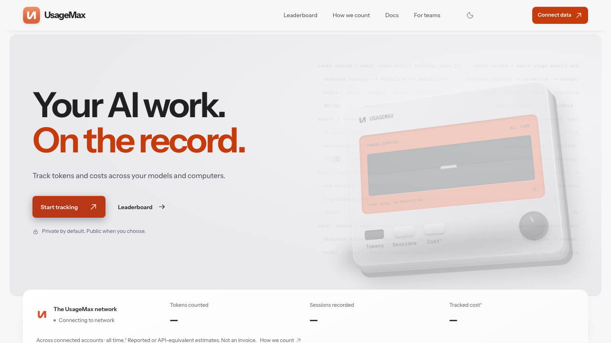

<div align="center">
  <a href="https://usagemax.com">
    
  </a>

  <h1>UsageMax</h1>

  <p><strong>Your AI work, in perspective.</strong><br>
  A private-by-default usage ledger for people and teams building with AI.</p>

  <p>
    <a href="https://usagemax.com">Live app</a> ·
    <a href="https://usagemax.com/docs">Docs</a> ·
    <a href="https://usagemax.com/integrations">Integrations</a> ·
    <a href="https://usagemax.com/pricing.md">Pricing</a> ·
    <a href="https://usagemax.com/methodology">How we count</a> ·
    <a href="https://github.com/SYMBaiEX/usagemax/issues">Issues</a>
  </p>

  <p>
    <a href="https://github.com/SYMBaiEX/usagemax/actions/workflows/ci.yml"></a>
    <a href="https://github.com/SYMBaiEX/usagemax/actions/workflows/codeql.yml"></a>
    <a href="https://www.npmjs.com/package/usagemax"></a>
    <a href="LICENSE"></a>
  </p>

  <p>
    <a href="https://www.skills.sh/symbaiex/usagemax/usage-observability"></a>
    <a href="https://www.skills.sh/symbaiex/usagemax/enterprise-reporting"></a>
    <a href="https://www.skills.sh/symbaiex/usagemax/collector-diagnostics"></a>
  </p>
</div>

<p align="center">
  <a href="https://usagemax.com"></a>
</p>

UsageMax reconciles the AI usage histories already on your computers into one
clear view of tokens, model mix, tracked cost, sessions, and activity. The
open-source CLI performs bounded local scans and uploads aggregate snapshots to
the versioned UsageMax API.

> **The short version:** one-shot collector, private by default, public only by
> choice. Prompts and completions never leave the computer.

## What you get

| Surface | Purpose |
| --- | --- |
| **Private workspace** | Compare computers, providers, models, projects, and cost centers in one tenant-scoped view. |
| **Public profile** | Opt-in profile, leaderboard, activity, model mix, cost estimate, and streaks. |
| **Collector API** | Installation-bound, write-only snapshots and content-free telemetry. |
| **`usagemax` CLI** | A `bunx`-friendly scanner with archive recovery, safe diagnostics, and optional OS scheduling. |
| **Agent interfaces** | Bounded OpenAPI, MCP, Markdown, WebMCP, A2A, and installable skill surfaces. |

The physical HUD/screen project is intentionally separate from this repository.
It can consume UsageMax telemetry, but it is not required to use the platform.

## Connect a computer

### 1. Create a link code

Sign in at [usagemax.com/account](https://usagemax.com/account), choose
**Link a computer**, give it a name, and copy the one-use command. The code is
valid for ten minutes and can be used once.

### 2. Link and sync

Run the command on the computer or WSL distribution that owns the history:

```bash
bunx usagemax link UMX-XXXX-XXXX-XXXX-XXXX

# Optional explicit name; the account keeps this name for the installation.
bunx usagemax link UMX-XXXX-XXXX-XXXX-XXXX --name "Work laptop"
```

The first link performs a full one-shot sync. Every installation receives a
stable random ID, so relinking or renaming it rotates its key without creating
a duplicate device.

### 3. Reconcile when you choose

```bash
bunx usagemax sync --dry-run --explain  # inspect the bounded plan
bunx usagemax sync                      # upload changed usage
bunx usagemax sync --full               # reconcile all retained history
bunx usagemax status --remote            # check the saved credential safely
```

### CLI updates and progress

The CLI checks npm's `latest` dist-tag at most twice per day and never replaces
itself silently. Run `usagemax update sync` to hand a command to the current
release without typing `@latest`, or set `USAGEMAX_AUTO_UPDATE=1` for an
explicit automatic handoff. Use `--no-update-check` or set
`USAGEMAX_DISABLE_UPDATE_CHECK=1` in offline environments. Interactive
terminals show a small stderr progress line; JSON,
quiet, CI, and scheduled runs remain machine-readable and quiet.

## Coverage and correctness

UsageMax pins [ccusage v20.0.23](https://github.com/ccusage/ccusage/releases/tag/v20.0.23)
and uses its 16 adapters: Amp, Claude Code, Codebuff, Codex, GitHub Copilot
CLI, Factory Droid, Gemini CLI, Goose, Grok Build, Hermes, Kilo Code, Kimi CLI,
OpenClaw, OpenCode, Pi, and Qwen Code. Named Pi-format stores are discovered as
well.

The collector recognizes supported provider overrides, bounded home locations,
Claude Desktop sessions, `.cc-mirror`, renamed Claude/Codex backup folders, and
supported Windows homes from WSL. Normal syncs inspect known locations and
immediate home entries; they do not crawl the whole disk.

```bash
bunx usagemax doctor                 # metadata-only coverage check
bunx usagemax doctor --deep --json   # retained-history audit
bunx usagemax sync --archives        # one-time compressed-history recovery
bunx usagemax report                 # local ccusage report
bunx usagemax status --json          # version, coverage, checkpoints, and link state
bunx usagemax update --json          # machine-readable npm release check
```

Full scans can catalog retained history from 2024 onward. Incomplete source
coverage never authorizes destructive corrections: decreases and missing rows
remain protected until the parser can prove the inventory is complete. Unknown
models stay `unattributed`; unknown pricing stays unknown.

Cursor, Windsurf, Aider, Continue, Cline, Roo Code, hosted agents, direct
provider API traffic, and enterprise billing systems do not all expose a stable
local ledger. Feed those through the native or OTLP/HTTP JSON contract, or use
a provider billing export when local evidence is unavailable.

## Privacy and resource use

| Stays on the computer | May be uploaded |
| --- | --- |
| Prompts and completions | Aggregate token counters |
| Source code and file contents | Provider, model, and source names |
| Project paths and tool payloads | Dates, costs, and coverage state |
| Provider credentials and secrets | Opaque SHA-256 session identities |

The CLI is short-lived. It skips unchanged inventories, parses only the
necessary date range, uses a local lock to prevent overlap, and never downloads
a package per run. Optional scheduling invokes the same one-shot process and
backs off after failures.

```bash
bun install -g usagemax
usagemax service install          # approximately every 15 minutes
usagemax service install --every 30
usagemax service status
usagemax service uninstall
```

Scheduling is opt-in. macOS uses a user LaunchAgent, Linux/WSL uses a user
systemd timer, and Windows uses Task Scheduler. Sleeping or battery-powered
computers are not needlessly woken.

## Credentials and safe diagnostics

UsageMax has separate credentials for website sign-in, one-use linking, and
collector writes. A collector key is exactly `umx_` followed by 64 lowercase
hexadecimal characters. It is generated server-side, displayed once, stored
locally with user-only permissions, and stored by UsageMax only as a SHA-256
hash.

For an **Advanced · custom telemetry collector** key, pipe the secret through
stdin. Never put it in a command-line argument, URL, request body, repository,
or log:

```bash
set +x
printf '%s' "$USAGEMAX_COLLECTOR_TOKEN" \
  | bunx usagemax token status \
      --device-id "$USAGEMAX_INSTALLATION_ID" \
      --json \
  | jq -r '[.httpStatus, (if .ingestAuthorized then 1 else 0 end)] | @tsv'
```

`token status` is included in CLI `0.3.8`. If a fresh environment still has an
older npm tag, run `usagemax update token status` or use
`node packages/cli/src/cli.js token status` from this repository until the new
package is published.

The numeric projection is deliberately small:

| Result | Meaning |
| --- | --- |
| `200 1` | Recognized, active, and authorized to ingest. |
| `200 0` | Recognized but blocked; inspect the redacted JSON status. |
| `409 0` | The installation UUID does not match the key binding. |
| `401 0` | The format/key was not accepted; the server does not reveal which reason. |

The read-only diagnostic reports credential type, scopes, activation state,
profile/name, binding state, and last accepted/rejected write. It never returns
the token, its hash, or the authorized UUID. Advanced keys are active
immediately; they bind on the first valid write. Linked CLI keys are bound
during the link exchange.

<details>
<summary>Optional zero-token telemetry smoke test</summary>

This sends exactly one content-free `agent_state` event. It has zero token and
zero cost fields, is observability-only, and prints only the HTTP status. Use a
disposable collector if you want to test the write path; the first valid write
may bind an unbound advanced key.

```bash
set +x
device_id="$USAGEMAX_INSTALLATION_ID"
batch_id="${USAGEMAX_DIAGNOSTIC_BATCH_ID:-hud-diagnostic-$(date -u +%Y%m%dT%H%M%SZ)-$$}"
occurred_at="${USAGEMAX_DIAGNOSTIC_OCCURRED_AT:-$(date -u +%Y-%m-%dT%H:%M:%SZ)}"

curl -sS -o /dev/null -w '%{http_code}\n' \
  --config <(
    printf '%s\n' \
      'url = "https://usagemax.com/api/v1/telemetry/llm"' \
      'request = "POST"' \
      "header = \"Authorization: Bearer $USAGEMAX_COLLECTOR_TOKEN\"" \
      "header = \"X-UsageMax-Device-ID: $device_id\"" \
      "header = \"Idempotency-Key: $batch_id\"" \
      'header = "Content-Type: application/json"'
  ) \
  --data-binary @- <<JSON
{"events":[{"eventKey":"$batch_id","eventType":"agent_state","accountingMode":"observability","source":"local-hud-relay","provider":"usagemax","model":"relay-activity","inputTokens":0,"outputTokens":0,"cacheReadTokens":0,"cacheWriteTokens":0,"reasoningTokens":0,"totalTokens":0,"costMicros":0,"status":"ok","state":"diagnostic","occurredAt":"$occurred_at","schemaVersion":1,"completeness":"unknown"}]}
JSON
```

Expected result: `202` for a new batch and `200` for an exact idempotent
replay. Only `model_request` events update accounting; this event cannot change
token totals or spend.

</details>

## Agent and developer surfaces

| Surface | URL |
| --- | --- |
| OpenAPI | [openapi.json](https://usagemax.com/openapi.json) |
| Agent capability view | [/?mode=agent](https://usagemax.com/?mode=agent) |
| Public MCP | [server-card.json](https://usagemax.com/.well-known/mcp/server-card.json) |
| Documentation MCP | [/docs-mcp](https://usagemax.com/docs-mcp) |
| A2A card | [agent-card.json](https://usagemax.com/.well-known/agent-card.json) |
| Skills index | [agent-skills/index.json](https://usagemax.com/.well-known/agent-skills/index.json) |
| MCP Registry metadata | [server.json](https://raw.githubusercontent.com/SYMBaiEX/usagemax/main/server.json) |
| Skill source and install docs | [`skills/`](https://github.com/SYMBaiEX/usagemax/tree/main/skills) · [skills.sh](https://www.skills.sh/) |
| Auth guide | [/auth.md](https://usagemax.com/auth.md) |

Public reads are bounded and unauthenticated. The public MCP servers are
stateless, read-only, and do not expose private workspace data or collector
credentials. Collector ingestion is a separate authenticated API boundary.

## Repository map

```text
src/             Next.js web app, public routes, docs, and UI
convex/          Convex schema, authorization, ingestion, and projections
packages/cli/    Distributable `usagemax` package
docs/            Architecture, contracts, coverage, operations, and releases
skills/          Direct-installable agent skills and source notes
server.json      MCP Registry submission metadata for the public remote server
```

For the documentation map, start with [docs/README.md](docs/README.md). It
separates public product and integration guidance from contributor, operator,
release, and historical records.

## MCP Registry and skills.sh status

The public MCP server is published in the official Registry as
[`io.github.SYMBaiEX/usagemax@1.0.0`](https://registry.modelcontextprotocol.io/v0.1/servers/io.github.SYMBaiEX%2Fusagemax/versions/latest).
The [server.json](server.json) file is the versioned source metadata for that
listing; it contains no package or credential claim. The three `skills/` cards
have valid `name` and `description` frontmatter and are indexed on
[skills.sh](https://www.skills.sh/symbaiex/usagemax/usage-observability):

```bash
npx skills add SYMBaiEX/usagemax --skill usage-observability
npx skills add SYMBaiEX/usagemax --skill enterprise-reporting
npx skills add SYMBaiEX/usagemax --skill collector-diagnostics
```

The digest-pinned [Agent Skills index](https://usagemax.com/.well-known/agent-skills/index.json)
is the deployed inventory; the raw GitHub files are the install sources. The
directory's automated security audit state is external to this repository and
can change independently of these files.

## Development

Requirements: [Bun 1.4.2](https://bun.sh/) and Node.js 20 or newer. The web app
also needs a configured Convex development deployment.

```bash
bun install
bun run check       # lint, typecheck, tests, and production build
bun run cli:pack    # verify the publishable CLI archive
```

For local web development, configure an ignored `.env.local`, then run
`bunx convex dev` and `bun run dev`. See
[CONTRIBUTING.md](CONTRIBUTING.md) for contribution boundaries and
[docs/RELEASE.md](docs/RELEASE.md) for release gates.

## Open source

UsageMax is released under the [MIT License](LICENSE). Third-party dependency
notices are in [NOTICE.md](NOTICE.md). Please report suspected vulnerabilities
privately through [SECURITY.md](SECURITY.md), not a public issue.
