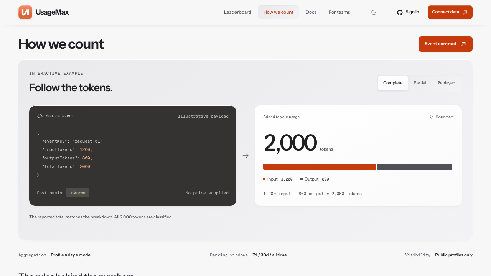

# UsageMax

UsageMax is a public observability layer for bounded AI usage telemetry. It
turns supported local coding-agent histories into aggregate usage data for a
private profile or workspace, with optional public projections such as
profiles and leaderboards.

The web application is built with Next.js and Convex. The companion `usagemax`
CLI performs bounded, one-shot local scans and sends aggregate snapshots over
the versioned `https://usagemax.com/api` contract. It does not run a resident
scanner or filesystem watcher.

[Website](https://usagemax.com) · [Documentation](https://usagemax.com/docs) ·
[OpenAPI](https://usagemax.com/openapi.json) · [CLI guide](packages/cli/README.md) ·
[License](LICENSE)

## At a glance

| Surface | Purpose |
| --- | --- |
| Private workspace | Reconcile usage across computers, providers, models, projects, and cost centers. |
| Public profile | Publish only the aggregate view you choose, including model mix and activity. |
| Collector API | Accept installation-bound, write-only snapshots and content-free telemetry. |
| Open source CLI | Scan locally, upload idempotently, and optionally run on an OS scheduler. |

The boundary is intentional: local files stay local, public reads are bounded,
and the optional screen/HUD is a separate project rather than a hidden service
inside the collector.

## Quick start

The CLI requires Node.js 20 or newer and works with Bun or npm:

```bash
bunx usagemax@latest --help
# or: npx usagemax@latest --help
```

To connect a computer:

1. Sign in at [usagemax.com/account](https://usagemax.com/account).
2. Choose **Link a computer** and copy the one-time `UMX-…` command.
3. Run that command on the computer containing the local usage history.

For example:

```bash
bunx usagemax@latest link UMX-XXXX-XXXX-XXXX-XXXX
bunx usagemax status
bunx usagemax sync --dry-run --explain
bunx usagemax sync
```

The link code expires after ten minutes and is used once. Create one for each
computer or WSL distribution. Linking stores a random, device-bound collector
key locally and starts a full one-shot sync unless `link --no-sync` is used.
The account-side computer name is retained; pass `--name "Work laptop"` only
to explicitly override it. Re-running, relinking, or changing the name keeps
the same private installation identity and does not create a duplicate device.

Automatic sync is optional and off by default. A persistent installation can
opt in with `usagemax service install`; the scheduler invokes the same
short-lived sync process and can be removed with `usagemax service uninstall`.

See the [CLI guide](packages/cli/README.md) for commands, supported local
providers, archive recovery, scheduling, and coverage limits.

## Product surface

These are rendered product screenshots kept with the repository as release
documentation:




## Safe zero-token observability test

The sandbox validator accepts one content-free event, requires no
authentication, and never writes data. This checks the public contract without
linking an account or sending a collector token:

```bash
curl -sS -X POST https://usagemax.com/api/v1/sandbox/validate \
  -H 'content-type: application/json' \
  --data "{\"events\":[{\"eventKey\":\"readme-zero-token\",\"model\":\"example-model\",\"occurredAt\":\"$(date -u +%Y-%m-%dT%H:%M:%SZ)\",\"totalTokens\":0,\"costMicros\":0}]}"
```

A successful response has `ok: true`, `accepted: 1`, and `writes: false`.
Use the [OpenAPI contract](https://usagemax.com/openapi.json) for the strict
field and timestamp rules.

## Diagnose a collector key

For a key already stored by the CLI, check its remote state without printing
the secret:

```bash
bunx usagemax@latest status --remote
```

For an advanced key, pipe it through stdin and optionally check the installation
UUID. This reports only the key format, collector state, scopes, profile,
computer name, and device-binding result:

```bash
printf '%s' "$USAGEMAX_COLLECTOR_TOKEN" \
  | bunx usagemax@latest token status \
      --device-id "$USAGEMAX_INSTALLATION_ID"
```

New advanced keys are active immediately and do not require activation or
propagation. A key created by the advanced flow starts unbound; its first valid
write binds the supplied installation UUID. An unknown key returns a generic
401. The diagnostic command never accepts a token as a command-line argument
and never prints it.

## Safe authenticated telemetry probe

This sends one content-free observability event with zero tokens and zero cost.
It is a write-path check, but it cannot change accounting totals. Keep shell
tracing disabled while the token is in an environment variable:

```bash
set +x
USAGEMAX_API='https://usagemax.com/api'
USAGEMAX_DIAGNOSTIC_KEY="hud-diagnostic-$(date -u +%Y%m%dT%H%M%SZ)-$$"

curl --fail-with-body -sS -X POST "$USAGEMAX_API/v1/telemetry/llm" \
  -H "Authorization: Bearer ${USAGEMAX_COLLECTOR_TOKEN}" \
  -H "X-UsageMax-Device-ID: ${USAGEMAX_INSTALLATION_ID}" \
  -H "Idempotency-Key: ${USAGEMAX_DIAGNOSTIC_KEY}" \
  -H 'Content-Type: application/json' \
  --data-binary @- <<JSON
{"events":[{"eventKey":"${USAGEMAX_DIAGNOSTIC_KEY}","eventType":"agent_state","accountingMode":"observability","source":"local-hud-relay","provider":"usagemax","model":"relay-activity","inputTokens":0,"outputTokens":0,"cacheReadTokens":0,"cacheWriteTokens":0,"reasoningTokens":0,"totalTokens":0,"costMicros":0,"status":"ok","state":"diagnostic","occurredAt":"$(date -u +%Y-%m-%dT%H:%M:%SZ)","schemaVersion":1,"completeness":"unknown"}]}
JSON
```

The expected success response is HTTP 202 with `accepted: 1` and zero
accounting contribution. A 401 means the server could not recognize the key;
run the read-only diagnostic above before creating another credential.

## Data and privacy

The CLI reads known local provider locations and sends bounded aggregates such
as token counts, model/provider names, costs, source names, dates, coverage
state, and opaque SHA-256 session identities. It does not send prompts,
completions, source code, file contents, project paths, or provider
credentials. Unsupported or missing source data is not invented.

Collector keys are write-scoped, device-bound, rate-limited, and revocable.
The local key is stored in a user-only config file where supported; the service
stores only its hash. Public projections are aggregate and opt-in. Workspace
data and exports require an authenticated UsageMax session.

## Supported outputs

- Private UsageMax profiles and workspace views from linked collectors.
- Public aggregate network statistics, opt-in profiles, leaderboards, and
  bounded daily usage reads.
- Read-only public API access through the [OpenAPI document](https://usagemax.com/openapi.json),
  [MCP](https://usagemax.com/mcp), and related public documentation.
- A local `ccusage` report via `usagemax report`.

The CLI currently uses the pinned `ccusage` adapter set documented in the
[CLI guide](packages/cli/README.md). Local coverage is not the same as provider
billing coverage; native telemetry and OTLP/HTTP JSON are available for other
content-free integrations documented by the API contract.

## Development

Requirements: [Bun](https://bun.sh/) 1.4.2, Node.js 20 or newer, and access to
a development Convex deployment for the web app.

```bash
bun install
bun run check
bun run cli:pack
```

`bun run check` runs linting, type checking, tests, and the production build.
`bun run cli:pack` verifies the CLI package contents without publishing it.
For local web development, configure an ignored `.env.local`, then run
`bunx convex dev` and `bun run dev`.

## Contributing and license

Keep changes focused and preserve the privacy and accounting boundaries. Read
[CONTRIBUTING.md](CONTRIBUTING.md), follow the [Code of Conduct](CODE_OF_CONDUCT.md),
and report vulnerabilities through [SECURITY.md](SECURITY.md), not a public
issue. Release preparation is documented in [docs/RELEASE.md](docs/RELEASE.md).

UsageMax and the CLI are released under the [MIT License](LICENSE); dependency
notices are in [NOTICE.md](NOTICE.md).
